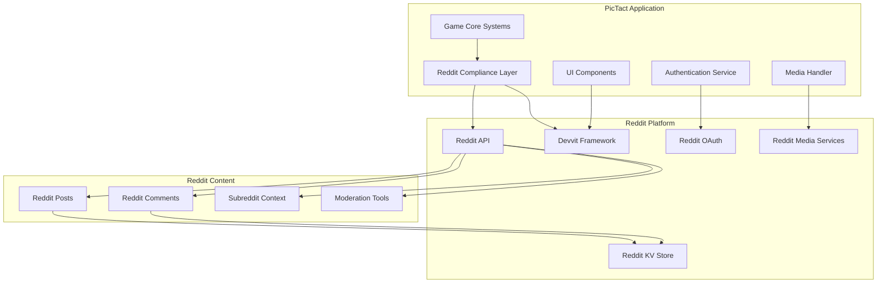
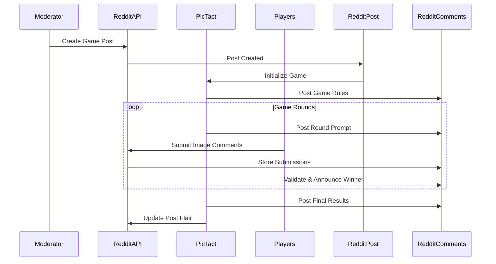

# Reddit Devvit Platform Compliance Design

## Overview

The Reddit Devvit Platform Compliance system provides a comprehensive integration layer that ensures all PicTact features work seamlessly within Reddit's ecosystem. This design addresses the specific requirements of Reddit's Devvit platform while maintaining the core gaming experience, focusing on native Reddit APIs, proper content handling, and platform-appropriate user interactions.

## Architecture

### High-Level Reddit Integration Architecture



### Reddit-Native Game Flow



## Components and Interfaces

### 1. Reddit Compliance Layer

**Purpose**: Central integration point for all Reddit platform interactions

**Key Methods**:
```typescript
interface RedditComplianceService {
  // Core Platform Integration
  getDevvitContext(): Promise<DevvitContext>;
  validateSubredditPermissions(action: string): Promise<boolean>;
  
  // Reddit API Wrappers
  createGamePost(config: GameConfig): Promise<RedditPost>;
  submitGameComment(postId: string, content: string): Promise<RedditComment>;
  uploadGameMedia(image: File): Promise<RedditMediaUrl>;
  
  // Content Policy Enforcement
  validateContent(content: any): Promise<ContentValidation>;
  enforceSubredditRules(content: any, subreddit: string): Promise<boolean>;
}

interface DevvitContext {
  postId: string;
  subreddit: string;
  userId?: string;
  moderatorPermissions?: ModeratorPermissions;
}
```

**Implementation Details**:
- Wraps all Reddit API calls with proper error handling and rate limiting
- Maintains subreddit context throughout the application lifecycle
- Provides unified interface for Reddit-specific operations
- Handles Reddit authentication state management

### 2. Reddit-Native Media Handler

**Purpose**: Manages image submissions through Reddit's media infrastructure

**Key Methods**:
```typescript
interface RedditMediaHandler {
  uploadImage(file: File, context: DevvitContext): Promise<RedditMediaResult>;
  validateImageContent(mediaUrl: string): Promise<ContentValidation>;
  getImageMetadata(mediaUrl: string): Promise<ImageMetadata>;
  handleNSFWContent(mediaUrl: string, subreddit: string): Promise<NSFWHandling>;
}

interface RedditMediaResult {
  mediaUrl: string;
  redditMediaId: string;
  thumbnailUrl?: string;
  isNSFW: boolean;
  contentWarnings: string[];
}
```

**Implementation Details**:
- Uses reddit.uploadMedia() API exclusively for image handling
- Integrates with Reddit's content scanning and NSFW detection
- Respects subreddit-specific media policies
- Provides fallback handling for upload failures

### 3. Reddit Comment-Based Real-Time Updates

**Purpose**: Provides live updates using Reddit's native comment system

**Key Methods**:
```typescript
interface RedditRealTimeService {
  initializeGameThread(postId: string): Promise<GameThread>;
  postRoundUpdate(threadId: string, update: RoundUpdate): Promise<RedditComment>;
  postLeaderboardUpdate(threadId: string, leaderboard: Leaderboard): Promise<RedditComment>;
  pollForUpdates(threadId: string, lastUpdate: Date): Promise<GameUpdate[]>;
}

interface GameThread {
  postId: string;
  gameCommentId: string;
  updateCommentIds: string[];
  lastUpdateTime: Date;
}
```

**Implementation Details**:
- Creates structured comment threads for game organization
- Uses Reddit's comment polling instead of WebSockets
- Maintains update history through comment chains
- Respects Reddit's API rate limits for polling

### 4. Subreddit-Aware Authentication

**Purpose**: Manages user authentication within subreddit contexts

**Key Methods**:
```typescript
interface RedditAuthService {
  getCurrentRedditUser(): Promise<RedditUser>;
  validateSubredditAccess(subreddit: string): Promise<AccessLevel>;
  getModeratorPermissions(subreddit: string): Promise<ModeratorPermissions>;
  createSubredditSession(context: DevvitContext): Promise<GameSession>;
}

interface RedditUser {
  username: string;
  userId: string; // Never stored, only used for session
  subredditRole: 'member' | 'moderator' | 'admin';
  permissions: SubredditPermissions;
}
```

**Implementation Details**:
- Uses reddit.getCurrentUsername() for all user identification
- Maintains separate session contexts per subreddit
- Never stores Reddit user IDs or personal information
- Integrates with Reddit's permission system

## Data Models

### Reddit-Compliant Game Data Schema

```typescript
interface RedditGameData {
  // Reddit Context (never stored)
  postId: string;
  subreddit: string;
  
  // Game-Specific Data (stored in KV)
  gameId: string;
  status: GameStatus;
  configuration: GameConfiguration;
  rounds: RedditRoundData[];
  
  // Reddit Integration Points
  gamePostId: string;
  gameCommentId: string;
  resultCommentIds: string[];
}

interface RedditRoundData {
  roundIndex: number;
  promptCommentId: string;
  submissionCommentIds: string[];
  winnerCommentId?: string;
  leaderboardCommentId?: string;
}

interface RedditSubmission {
  // Reddit References
  commentId: string;
  parentCommentId: string;
  redditMediaUrl: string;
  
  // Game Data
  playerId: string; // App-specific, not Reddit ID
  submissionTime: Date;
  validationResult?: ValidationResult;
}
```

### Reddit-Compliant User Profile Schema

```typescript
interface RedditCompliantProfile {
  // App-Specific Identity (stored)
  profileId: string;
  displayName?: string;
  createdAt: Date;
  
  // Reddit Context (never stored)
  currentRedditUsername?: string; // Only for current session
  
  // Game Statistics (stored)
  gameStats: {
    totalMatches: number;
    totalWins: number;
    subredditStats: Map<string, SubredditGameStats>;
  };
  
  // Privacy Settings (stored)
  privacySettings: {
    allowCrossSubredditStats: boolean;
    allowDataExport: boolean;
    profileVisibility: 'public' | 'subreddit' | 'private';
  };
}
```

## Error Handling

### Reddit API Integration Errors

1. **Rate Limit Handling**: Exponential backoff with user-friendly messaging
2. **Authentication Failures**: Graceful fallback to anonymous mode with Reddit context
3. **Permission Denied**: Clear messaging about subreddit-specific restrictions
4. **API Unavailability**: Cached data serving with degraded functionality

### Content Policy Violations

1. **NSFW Content**: Automatic handling based on subreddit settings
2. **Spam Detection**: Integration with Reddit's spam filtering
3. **Community Guidelines**: Escalation to Reddit's moderation tools
4. **Copyright Issues**: Integration with Reddit's DMCA processes

### Platform Integration Errors

1. **Devvit Context Loss**: Graceful degradation with error reporting
2. **KV Store Failures**: Retry logic with temporary local storage
3. **Media Upload Failures**: Alternative submission methods with user guidance
4. **Cross-Platform Inconsistencies**: Platform-specific feature adaptation

## Testing Strategy

### Reddit Integration Testing

1. **Mock Reddit APIs**: Comprehensive mocking of all Reddit API endpoints
2. **Subreddit Context Testing**: Validation of subreddit-specific behavior
3. **Permission Testing**: Verification of moderator and user permission handling
4. **Rate Limit Testing**: Simulation of Reddit API rate limiting scenarios

### Content Policy Compliance Testing

1. **NSFW Content Handling**: Automated testing of content filtering
2. **Spam Detection Integration**: Validation of spam prevention measures
3. **Community Guidelines**: Testing of content policy enforcement
4. **Cross-Subreddit Compliance**: Verification of subreddit-specific rules

### Platform Compatibility Testing

1. **Multi-Platform Testing**: Validation across Reddit web, mobile, and third-party clients
2. **Performance Testing**: Resource usage within Devvit constraints
3. **Accessibility Testing**: Compliance with Reddit's accessibility standards
4. **Integration Testing**: End-to-end testing of Reddit-native workflows

## Security Considerations

### Reddit Data Privacy

1. **User ID Protection**: Never store Reddit user IDs in persistent storage
2. **Username Handling**: Use current session usernames only, never persist
3. **Cross-Subreddit Privacy**: Respect user privacy preferences across communities
4. **Data Export Compliance**: Redact all Reddit-specific identifiers from exports

### Platform Security

1. **API Key Management**: Secure handling of Reddit API credentials through Devvit
2. **Content Validation**: Integration with Reddit's content scanning systems
3. **Moderation Integration**: Proper escalation to Reddit's moderation tools
4. **Audit Logging**: Comprehensive logging through Reddit's audit systems

### Subreddit Isolation

1. **Data Segregation**: Maintain strict separation of subreddit-specific data
2. **Permission Boundaries**: Respect subreddit moderator authority
3. **Content Isolation**: Prevent cross-subreddit content leakage
4. **Configuration Isolation**: Maintain separate settings per subreddit

## Performance Optimization

### Reddit API Efficiency

1. **Request Batching**: Group multiple operations where Reddit APIs support it
2. **Caching Strategy**: Cache Reddit data appropriately while respecting freshness requirements
3. **Rate Limit Management**: Intelligent request scheduling to maximize API usage
4. **Polling Optimization**: Efficient comment polling for real-time updates

### Resource Management

1. **KV Store Optimization**: Efficient data structures for Reddit-compliant storage
2. **Memory Management**: Minimize memory usage within Devvit constraints
3. **Processing Efficiency**: Optimize algorithms for Reddit's infrastructure
4. **Bandwidth Optimization**: Minimize data transfer through efficient payloads

### Scalability Within Reddit

1. **Horizontal Scaling**: Design for Reddit's distributed infrastructure
2. **Load Distribution**: Efficient handling of concurrent subreddit instances
3. **Resource Monitoring**: Integration with Reddit's monitoring systems
4. **Performance Metrics**: Reddit-native performance tracking and optimization