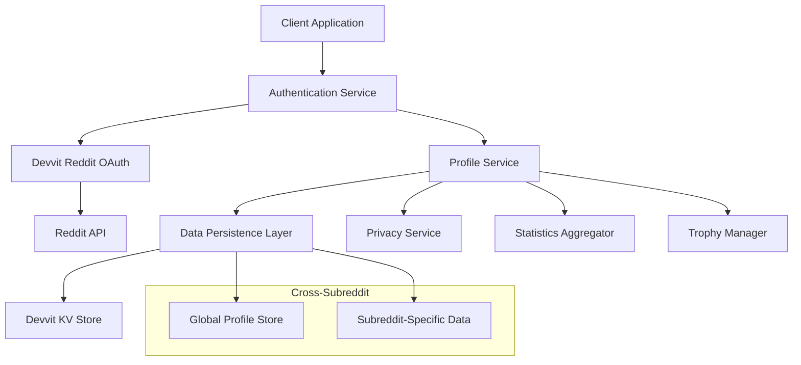
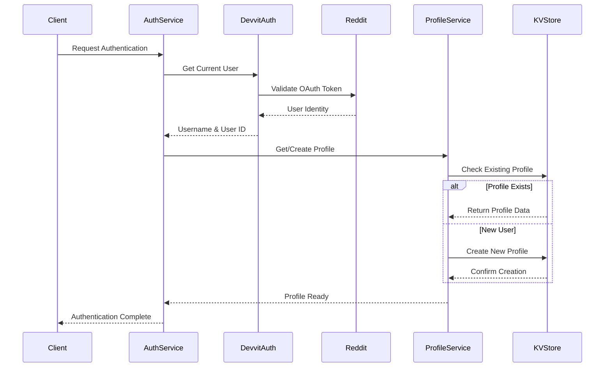

# User Authentication & Profile Management Design

## Overview

The User Authentication & Profile Management system provides seamless Reddit-based authentication and comprehensive user profile management for PicTact. The system leverages Devvit's built-in Reddit OAuth integration while extending it with persistent profile storage, cross-subreddit identity management, and privacy controls.

## Architecture

### High-Level Architecture



### Authentication Flow



## Components and Interfaces

### 1. Authentication Service

**Purpose**: Manages Reddit OAuth integration and session handling

**Key Methods**:
```typescript
interface AuthenticationService {
  getCurrentUser(): Promise<AuthenticatedUser>;
  validateSession(): Promise<boolean>;
  refreshAuthentication(): Promise<void>;
  logout(): Promise<void>;
}

interface AuthenticatedUser {
  redditUsername: string;
  redditUserId: string;
  sessionToken: string;
  permissions: UserPermissions;
  isAnonymous: boolean;
}
```

**Implementation Details**:
- Wraps Devvit's `reddit.getCurrentUsername()` and context APIs
- Handles session token generation and validation
- Manages authentication state across requests
- Provides fallback for anonymous users

### 2. Profile Service

**Purpose**: Manages user profile creation, updates, and retrieval

**Key Methods**:
```typescript
interface ProfileService {
  getProfile(userId: string): Promise<UserProfile>;
  createProfile(user: AuthenticatedUser): Promise<UserProfile>;
  updateProfile(userId: string, updates: ProfileUpdates): Promise<UserProfile>;
  deleteProfile(userId: string): Promise<void>;
  exportProfile(userId: string): Promise<ProfileExport>;
}

interface UserProfile {
  userId: string;
  redditUsername: string;
  displayName?: string;
  createdAt: Date;
  lastActiveAt: Date;
  preferences: UserPreferences;
  privacySettings: PrivacySettings;
  lifetimeStats: LifetimeStatistics;
  trophyCollection: Trophy[];
}
```

**Implementation Details**:
- Uses KV store with key pattern: `profile:{userId}`
- Implements atomic updates for concurrent safety
- Handles profile migration and versioning
- Provides caching for frequently accessed profiles

### 3. Privacy Service

**Purpose**: Manages user privacy controls and data visibility

**Key Methods**:
```typescript
interface PrivacyService {
  getVisibleProfile(userId: string, viewerId: string): Promise<PublicProfile>;
  updatePrivacySettings(userId: string, settings: PrivacySettings): Promise<void>;
  canViewData(userId: string, viewerId: string, dataType: DataType): boolean;
  anonymizeProfile(profile: UserProfile): AnonymousProfile;
}

interface PrivacySettings {
  profileVisibility: 'public' | 'friends' | 'private';
  showLifetimeStats: boolean;
  showTrophies: boolean;
  showRecentActivity: boolean;
  allowDataExport: boolean;
}
```

**Implementation Details**:
- Filters profile data based on privacy settings
- Implements role-based access control
- Provides anonymous participation mode
- Handles GDPR compliance requirements

### 4. Cross-Subreddit Identity Manager

**Purpose**: Maintains unified user identity across different subreddit instances

**Key Methods**:
```typescript
interface CrossSubredditManager {
  getGlobalProfile(userId: string): Promise<GlobalProfile>;
  getSubredditProfile(userId: string, subreddit: string): Promise<SubredditProfile>;
  aggregateStats(userId: string): Promise<AggregatedStats>;
  syncProfiles(userId: string): Promise<void>;
}

interface GlobalProfile {
  userId: string;
  totalMatches: number;
  totalWins: number;
  globalRanking: number;
  subredditParticipation: SubredditStats[];
}
```

**Implementation Details**:
- Uses hierarchical KV keys: `global:{userId}` and `subreddit:{subreddit}:{userId}`
- Implements eventual consistency for cross-subreddit data
- Provides aggregation services for global statistics
- Handles subreddit-specific customizations

## Data Models

### User Profile Schema

```typescript
interface UserProfile {
  // Identity
  userId: string;                    // Reddit user ID
  redditUsername: string;            // Current Reddit username
  displayName?: string;              // Custom display name
  
  // Timestamps
  createdAt: Date;
  lastActiveAt: Date;
  lastProfileUpdate: Date;
  
  // Preferences
  preferences: {
    notifications: NotificationSettings;
    gameSettings: GamePreferences;
    accessibility: AccessibilityOptions;
  };
  
  // Privacy
  privacySettings: PrivacySettings;
  
  // Statistics
  lifetimeStats: {
    totalMatches: number;
    totalWins: number;
    totalPoints: number;
    averageSolveTime: number;
    favoriteThemes: string[];
    winRate: number;
  };
  
  // Achievements
  trophyCollection: Trophy[];
  badges: Badge[];
  
  // Cross-subreddit data
  subredditStats: Map<string, SubredditStats>;
}
```

### Session Management Schema

```typescript
interface UserSession {
  sessionId: string;
  userId: string;
  redditUsername: string;
  createdAt: Date;
  expiresAt: Date;
  lastActivity: Date;
  permissions: UserPermissions;
  subredditContext?: string;
}
```

## Error Handling

### Authentication Errors

1. **OAuth Failures**: Graceful fallback to anonymous mode
2. **Session Expiry**: Automatic re-authentication with user notification
3. **Permission Denied**: Clear error messages with resolution steps
4. **Rate Limiting**: Exponential backoff with user feedback

### Profile Management Errors

1. **Profile Creation Failures**: Retry logic with fallback to temporary profiles
2. **Data Corruption**: Automatic recovery from backup data
3. **Concurrent Updates**: Optimistic locking with conflict resolution
4. **Storage Failures**: Graceful degradation with local caching

### Privacy and Security Errors

1. **Unauthorized Access**: Immediate denial with audit logging
2. **Data Breach Detection**: Automatic lockdown and notification
3. **Privacy Violations**: Immediate correction with user notification
4. **Export Failures**: Retry mechanisms with progress tracking

## Testing Strategy

### Unit Tests

1. **Authentication Service Tests**
   - OAuth integration mocking
   - Session management validation
   - Error handling scenarios
   - Anonymous user flows

2. **Profile Service Tests**
   - CRUD operations validation
   - Concurrent update handling
   - Data migration testing
   - Export/import functionality

3. **Privacy Service Tests**
   - Access control validation
   - Data filtering accuracy
   - Anonymous mode testing
   - GDPR compliance verification

### Integration Tests

1. **End-to-End Authentication Flow**
   - Complete login/logout cycles
   - Cross-subreddit identity verification
   - Session persistence testing
   - Error recovery scenarios

2. **Profile Management Integration**
   - Profile creation and updates
   - Statistics aggregation accuracy
   - Trophy collection management
   - Privacy setting enforcement

3. **Cross-Subreddit Functionality**
   - Identity synchronization
   - Statistics aggregation
   - Data consistency verification
   - Performance under load

### Performance Tests

1. **Authentication Performance**
   - Login response times
   - Session validation speed
   - Concurrent authentication handling
   - Memory usage optimization

2. **Profile Operations Performance**
   - Profile retrieval speed
   - Update operation efficiency
   - Statistics calculation performance
   - Export generation time

## Security Considerations

### Data Protection

1. **Encryption**: All sensitive data encrypted at rest and in transit
2. **Access Control**: Role-based permissions with principle of least privilege
3. **Audit Logging**: Comprehensive logging of all authentication and profile operations
4. **Data Minimization**: Only collect and store necessary user data

### Privacy Compliance

1. **GDPR Compliance**: Full data portability and deletion capabilities
2. **Consent Management**: Clear opt-in/opt-out mechanisms
3. **Data Anonymization**: Proper anonymization for deleted accounts
4. **Cross-Border Data**: Compliance with international data transfer regulations

### Session Security

1. **Token Management**: Secure token generation and validation
2. **Session Expiry**: Appropriate timeout policies
3. **Concurrent Sessions**: Safe handling of multiple active sessions
4. **Logout Security**: Complete session invalidation on logout

## Performance Optimization

### Caching Strategy

1. **Profile Caching**: In-memory caching for frequently accessed profiles
2. **Statistics Caching**: Cached aggregations with smart invalidation
3. **Permission Caching**: Cached access control decisions
4. **Cross-Subreddit Caching**: Distributed caching for global data

### Database Optimization

1. **Key Design**: Efficient KV key patterns for fast retrieval
2. **Batch Operations**: Grouped operations for better performance
3. **Data Compression**: Compressed storage for large profile data
4. **Indexing Strategy**: Optimized data structures for common queries

### Scalability Considerations

1. **Horizontal Scaling**: Stateless service design for easy scaling
2. **Load Distribution**: Efficient load balancing across instances
3. **Resource Management**: Memory and CPU optimization
4. **Monitoring**: Comprehensive performance monitoring and alerting